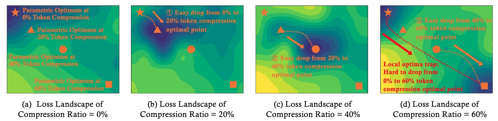
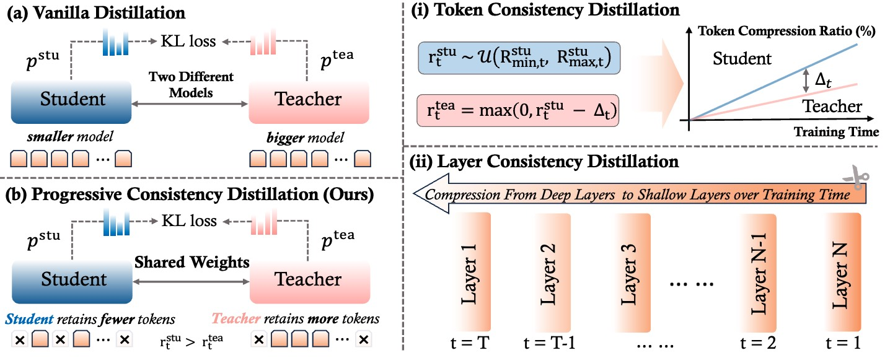
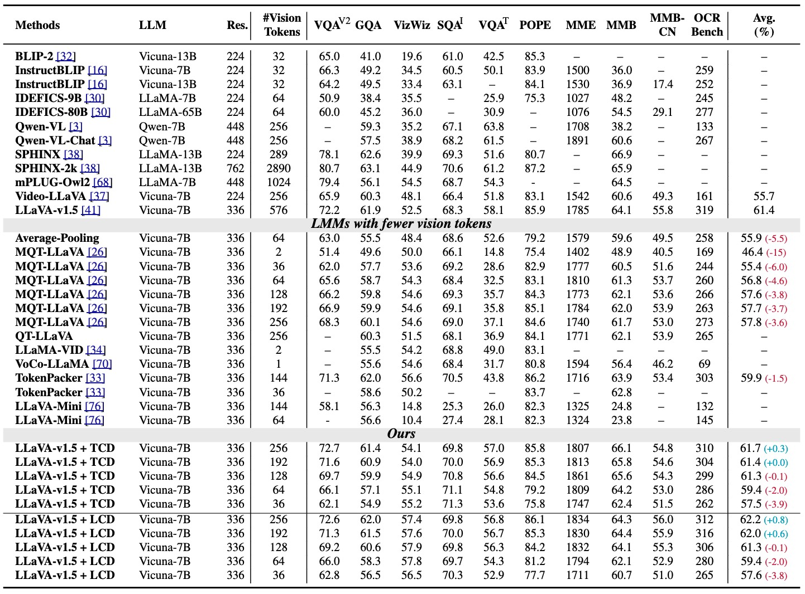
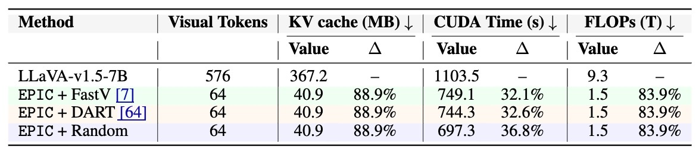
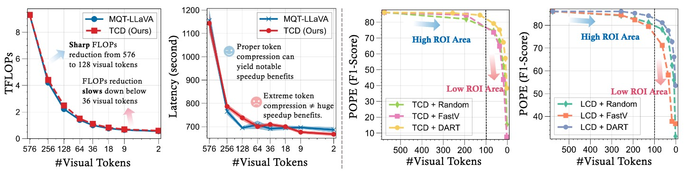
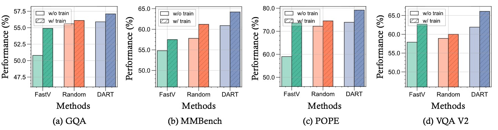

# Efficient Multi-modal Large Language Models via Progressive Consistency Distillation


[](https://arxiv.org/pdf/2510.00515)
[](https://zichenwen1.github.io/EPIC/)
[](https://github.com/zichenwen1/EPIC)
[](https://www.apache.org/licenses/LICENSE-2.0)
<!-- [](https://huggingface.co/collections/Haozhan72/simplevla-rl-6833311430cd9df52aeb1f86) -->


<p align="left">
  <b>
    Zichen Wen<sup>1,2</sup> &emsp;
    Shaobo Wang<sup>1</sup> &emsp;
    Yufa Zhou<sup>3</sup> &emsp;
    Junyuan Zhang<sup>4</sup> <br>
    Qintong Zhang<sup>5</sup> &emsp;
    Yifeng Gao<sup>1</sup> &emsp;
    Zhaorun Chen<sup>6</sup> &emsp;
    Bin Wang<sup>2</sup> &emsp;
    Weijia Li<sup>7,2</sup> <br>
    Conghui He<sup>2</sup><sup>*</sup> &emsp;
    Linfeng Zhang<sup>1</sup><sup>*</sup>
  </b>
  <br>
  <sup>1</sup>EPIC Lab, Shanghai Jiao Tong University &emsp;
  <sup>2</sup>Shanghai AI Laboratory <br>
  <sup>3</sup>Duke University &emsp;
  <sup>4</sup>The University of Hong Kong <br>
  <sup>5</sup>Peking University &emsp;
  <sup>6</sup>University of Chicago &emsp;
  <sup>7</sup>Sun Yat-sen University
  <br>
  <sub><sup>*</sup>Corresponding authors</sub>
</p>


## 📰 News
* **`2025.10.13`** 🎉 We have released our code for [EPIC](https://github.com/zichenwen1/EPIC)!
* **`2025.10.01`** 🤗🤗 We release our latest work [EPIC](https://arxiv.org/pdf/2510.00515), an efficient framework for progressive consistency distillation in multi-modal large language models.


## 📖 Overview
<p align="center">
  
</p>
Visual tokens consume substantial computational resources in multi-modal large models (MLLMs), significantly compromising their efficiency. Recent works have attempted to improve efficiency by compressing visual tokens during training, either through modifications to model components or by introducing additional parameters. However, they often overlook the increased learning difficulty caused by such compression, as the model's parameter space struggles to quickly adapt to the substantial perturbations in the feature space induced by token compression.


<br>


<p align="center">
  
</p>

In this work, we propose to develop **E**fficient MLLMs via **P**rogress**I**ve **C**onsistency Distillation (**EPIC**), a progressive learning framework. Specifically, by decomposing the feature space perturbations introduced by token compression along the token-wise and layer-wise dimensions, we introduce token consistency distillation and layer consistency distillation, respectively, aiming to reduce the training difficulty by leveraging guidance from a teacher model and following a progressive learning trajectory.

## 🎯 Key Features

- **Progressive Learning**: Token compression ratio increases progressively over time, or compression layers progressively shift from deeper to shallower layers
- **Self-Consistency Distillation**: Teacher and student share weights with no extra model introduced
- **Multiple Token Compression Strategies**: Supports DART, FastV, and Random token compression

## 🚀 Quick Start

### Prerequisites

```bash
# Clone this repository and navigate to EPIC folder
git clone https://github.com/zichenwen1/EPIC
cd EPIC
```

```bash
# Create conda environment
conda create -n EPIC python=3.10 -y
conda activate EPIC

# Install torch and flash attention
pip install torch torchvision torchaudio
pip install flash_attn --no-build-isolation # This may depend on your versions of torch, python, and cuda

# Install dependencies
pip install -r requirements.txt

# Key dependencies include:
# - transformers
# - deepspeed
# - torch (with CUDA support)
# - peft
# - tensorboard
```

### Training

#### 1. Prepare Data

Please download the annotation of the final mixture our instruction tuning data [llava_v1_5_mix665k.json](https://huggingface.co/datasets/liuhaotian/LLaVA-Instruct-150K/blob/main/llava_v1_5_mix665k.json), and download the images from constituting datasets:

- COCO: [train2017](http://images.cocodataset.org/zips/train2017.zip)
- GQA: [images](https://downloads.cs.stanford.edu/nlp/data/gqa/images.zip)
- OCR-VQA: [download script](https://drive.google.com/drive/folders/1_GYPY5UkUy7HIcR0zq3ZCFgeZN7BAfm_?usp=sharing), **we save all files as `.jpg`**
- TextVQA: [train_val_images](https://dl.fbaipublicfiles.com/textvqa/images/train_val_images.zip)
- VisualGenome: [part1](https://cs.stanford.edu/people/rak248/VG_100K_2/images.zip), [part2](https://cs.stanford.edu/people/rak248/VG_100K_2/images2.zip)

After downloading all of them, organize the data as follows in `./playground/data`,

```
├── coco
│   └── train2017
├── gqa
│   └── images
├── ocr_vqa
│   └── images
├── textvqa
│   └── train_images
└── vg
    ├── VG_100K
    └── VG_100K_2
```

#### 2. Configure Training

Edit `scripts/v1_5/finetune_TCD.sh` to set your parameters:

```bash
# Model configuration
MODEL_NAME_OR_PATH="/path/to/your/base/model"
VISION_TOWER="/path/to/vision/tower"
MM_PROJECTOR="/path/to/mm_projector"

# Training configuration
BATCH_SIZE=4
LEARNING_RATE=2e-5
MM_VISION_TOWER_LR=2e-6
NUM_EPOCHS=3

# Compression configuration
PRUNING_METHOD="dart"  # Options: dart, fastv, random
PRUNED_LAYER=2
SECOND_PRUNED_LAYER=15
REDUCTION_RATIO=0.5
```

#### 3. Run Training

```bash
bash scripts/v1_5/finetune_TCD.sh dart
bash scripts/v1_5/finetune_TCD.sh fastv  
bash scripts/v1_5/finetune_TCD.sh random
```
<!-- # # Method 2: Direct execution with DeepSpeed
# deepspeed --num_gpus=8 llava/train/train_mem_KD_TCD.py \
#     --model_name_or_path /path/to/your/model \
#     --vision_tower /path/to/vision/tower \
#     --mm_projector /path/to/mm_projector \
#     --pruning_method dart \
#     --pruned_layer 2 \
#     --second_pruned_layer 15 \
#     --reduction_ratio 0.5 \
#     --mm_tunable_parts "mm_vision_tower,mm_mlp_adapter,mm_language_model" \
#     --mm_vision_tower_lr 2e-6 \
#     --learning_rate 2e-5 \
#     --deepspeed scripts/zero3.json -->

## 🏗️ Project Structure

```text
EPIC_dev/
├── assets/                         # Project assets and images
│   ├── motivation.jpg
│   └── overview.jpg
├── checkpoints/                    # Model checkpoints and training logs
├── docs/                          # Documentation
│   ├── Customize_Component.md
│   ├── Data.md
│   ├── Evaluation.md
│   ├── Finetune_Custom_Data.md
│   ├── Intel.md
│   ├── LLaVA_Bench.md
│   ├── LLaVA_from_LLaMA2.md
│   ├── LoRA.md
│   ├── macOS.md
│   ├── MODEL_ZOO.md
│   ├── ScienceQA.md
│   └── Windows.md
├── llava/
│   ├── model/
│   │   ├── pruning_methods/        # Token compression methods
│   │   │   ├── config.py          # Configuration management
│   │   │   ├── factory.py         # Model factory
│   │   │   ├── models.py          # Compression model implementations
│   │   │   └── trainer_factory.py # Trainer factory
│   │   ├── language_model/        # Language model implementations
│   │   │   ├── dart/             # DART compression
│   │   │   ├── fastv/            # FastV compression
│   │   │   ├── random/           # Random compression
│   │   │   ├── llava_llama.py    # LLaVA LLaMA implementation
│   │   │   ├── llava_mistral.py  # LLaVA Mistral implementation
│   │   │   └── llava_mpt.py      # LLaVA MPT implementation
│   │   ├── multimodal_encoder/   # Multimodal encoder components
│   │   ├── multimodal_projector/ # Multimodal projector components
│   │   └── llava_arch.py         # LLaVA architecture
│   ├── train/
│   │   ├── train_mem_KD_TCD.py   # Memory-efficient KD training
│   │   ├── train_TCD.py          # TCD training script
│   │   ├── llava_trainer_KD_from_pretrain_*.py  # Specialized KD trainers
│   │   ├── llava_trainer_KD.py   # Knowledge distillation trainer
│   │   └── llava_trainer.py      # Base trainer
│   ├── eval/                     # Evaluation scripts
│   │   ├── eval_*.py            # Various evaluation scripts
│   │   └── webpage/             # Web-based evaluation interface
│   └── serve/                   # Model serving components
│       ├── cli.py
│       ├── controller.py
│       ├── gradio_web_server.py
│       ├── model_worker.py
│       └── sglang_worker.py
├── scripts/
│   ├── v1_5/
│   │   ├── eval/                # Evaluation scripts
│   │   │   ├── gqa.sh
│   │   │   ├── mmbench.sh
│   │   │   ├── pope.sh
│   │   │   └── ...
│   │   ├── finetune_TCD.sh      # TCD fine-tuning script
│   │   └── multi_node_train.sh  # Multi-node training
│   ├── finetune*.sh             # Various fine-tuning scripts
│   ├── pretrain*.sh             # Pre-training scripts
│   └── zero3.json               # DeepSpeed configuration
├── PRUNING_METHODS_REFACTOR.md  # Pruning methods documentation
├── pyproject.toml               # Python project configuration
├── requirements.txt             # Dependencies
└── README.md                    # This file
```

<!-- ## 🔧 Configuration

### Compression Methods

| Method | Description | Key Parameters | Implementation |
|--------|-------------|----------------|----------------|
| **DART** | Dynamic Attention with Token Reduction | `pruned_layer`, `second_pruned_layer` | `llava/model/language_model/dart/` |
| **FastV** | Fast Vision Token Compression | `reduction_ratio` | `llava/model/language_model/fastv/` |
| **Random** | Random Token Selection | `reduction_ratio` | `llava/model/language_model/random/` | -->

### Implementation Details

- **Model Factory**: `llava/model/pruning_methods/factory.py` - Creates models based on compression method
- **Trainer Factory**: `llava/model/pruning_methods/trainer_factory.py` - Creates specialized trainers
- **Configuration**: `llava/model/pruning_methods/config.py` - Manages compression parameters
- **TCD Training**: `llava/train/train_mem_KD_TCD.py` - Main training entry point

<!-- ### Training Parameters

| Parameter | Description | Default | Range |
|-----------|-------------|---------|-------|
| `pruning_method` | Compression strategy | `dart` | `dart`, `fastv`, `random` |
| `pruned_layer` | Layer for token compression | `2` | `1-32` |
| `reduction_ratio` | Token compression ratio | `0.5` | `0.1-0.9` |
| `mm_vision_tower_lr` | Vision tower learning rate | `2e-6` | `1e-6` to `1e-4` |
| `learning_rate` | Main learning rate | `2e-5` | `1e-5` to `1e-3` | -->

<!-- ### Tunable Components

Control which model components are trained:

```bash
# Train all components
--mm_tunable_parts "mm_vision_tower,mm_mlp_adapter,mm_language_model"

# Train only projection layer
--mm_tunable_parts "mm_mlp_adapter"

# Train vision tower and language model
--mm_tunable_parts "mm_vision_tower,mm_language_model"
``` -->

## 📊 Results

### Performance on Visual Understanding Benchmarks
<p align="center">
  
</p>

### Inference Efficiency
<p align="center">
  
</p>


<!-- ## 🧪 Evaluation

### Run Evaluation

```bash
# Evaluate on specific benchmarks
python llava/eval/eval_vqa.py --model-path /path/to/your/model
python llava/eval/eval_mmbench.py --model-path /path/to/your/model
```

### Supported Benchmarks

- **VQAv2**: Visual Question Answering
- **GQA**: Compositional Question Answering
- **POPE**: Hallucination Detection
- **MME**: Multimodal Evaluation
- **MMBench**: Multimodal Benchmark
- **ScienceQA**: Science Question Answering
- **TextVQA**: Text-based Visual Question Answering
- **MMMU**: Multimodal Multitask Understanding
- **ChartQA**: Chart Question Answering
- **DocVQA**: Document Visual Question Answering -->

## 🔬 Analysis

### High ROI vs Low ROI Areas

Our analysis shows that:

- **High ROI**: Reducing tokens from 576 to 64 preserves most performance with significant efficiency gains
- **Low ROI**: Further compression below 64 tokens yields diminishing returns in speed and sharp accuracy drops

<p align="center">
  
</p>


### Generalization Across Methods

EPIC enables strong generalization across different token compression strategies. Models trained with one method (e.g., DART) perform well with other methods (FastV, Random) at inference

<p align="center">
  
</p>

## 📌 TODO
- [ ] Release checkpoints
- [ ] Release LCD implementation
- [ ] Release evaluation code


<!-- ## 🛠️ Advanced Features

### Custom Metrics Tracking

The implementation includes custom metrics for monitoring training progress:

```python
# Custom metrics logged to TensorBoard
- student_reduction_ratio: Student model token reduction ratio
- teacher_reduction_ratio: Teacher model token reduction ratio  
- teacher_gap: Performance gap between teacher and student
- distillation_loss: Knowledge distillation loss
- student_loss_sft: Student supervised fine-tuning loss
- total_loss: Combined training loss
```

### Memory Optimization

- **DeepSpeed ZeRO-3**: Optimized for large-scale training
- **Gradient Checkpointing**: Reduces memory usage during training
- **Mixed Precision**: FP16/BF16 support for faster training
- **Dynamic Batching**: Efficient batch processing

### Offline Training Support

- **TensorBoard Integration**: Offline logging without internet connection
- **Checkpoint Management**: Automatic checkpoint saving and resuming
- **Progress Tracking**: Detailed training progress monitoring -->

## 📚 Citation

If you find this work useful, please cite our paper:

```bibtex
@article{wen2025efficient,
    title={Efficient Multi-modal Large Language Models via Progressive Consistency Distillation},
    author={Wen, Zichen and Wang, Shaobo and Zhou, Yufa and Zhang, Junyuan and Zhang, Qintong and Gao, Yifeng and Chen, Zhaorun and Wang, Bin and Li, Weijia and He, Conghui and others},
    journal={arXiv preprint arXiv:2510.00515},
    year={2025}
}
```

## 🤝 Contributing

We welcome contributions! Please feel free to submit issues and pull requests.

## 📄 License

This project is licensed under the Creative Commons Attribution-ShareAlike 4.0 International License. See the [LICENSE](LICENSE) file for details.

## 🙏 Acknowledgments

- [LLaVA](https://github.com/haotian-liu/LLaVA) for the base multimodal framework
- [DeepSpeed](https://github.com/microsoft/DeepSpeed) for efficient training
- [Transformers](https://github.com/huggingface/transformers) for model implementations

## 📞 Contact

- **Email**: zichen.wen@outlook.com
- **Project Page**: [https://zichenwen1.github.io/EPIC/](https://zichenwen1.github.io/EPIC/)
- **Paper**: [arXiv:2510.00515](https://arxiv.org/abs/2510.00515)

